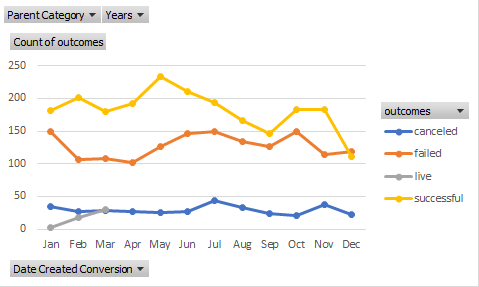
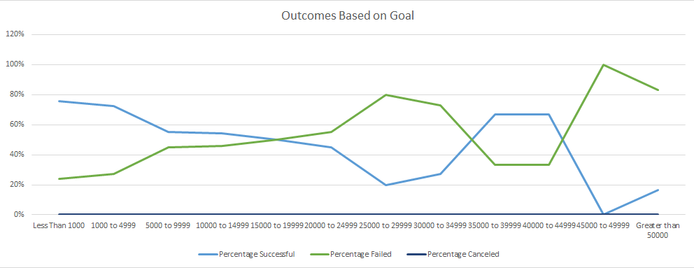

# An Analysis of Kickstarter Campaigns
## Overview
Louise is a playwright interested in using a CrowdFunding campaign for $10,000 for a play.
She would like to know more about successful campaigns.
### Purpose
We are tasked with determining factors that were present in other successful campaigns.
## Analysis and Challenges
* Used the file "Kickstarter_Challenge.xslx" as the source data of our analysis.
* Calculated percentage funded using the pledged and goal amounts.
* Calculated years after converting unix time stamps into standard dates.
* Used the Countifs() function to determine how many play campaigns were successfule, failed or canceled.
* Calculated percentages on the count results.
* Created several pivot tables and graphs to show our results.
### Analysis of Outcomes Based on Launch Date
* May is the best month to launch successful campaigns.
* Campaigns were twice as succeesful as failed ones (2:1 ratio).
* December is the worst month with greater failures. 

### Analysis of Outcomes Based on Goals
* Campaigns with budgets of $5,000 or less have a higher success rate (3:1 ratio).
* Campaigns with budgets between $5,000 and $15,000 were 9% more successful than failed ones.

## Recommendations
From our analysis, we recommend launching in May-June with a much lower goal ($5,000) and a shorter period to increase the probablity of success.
