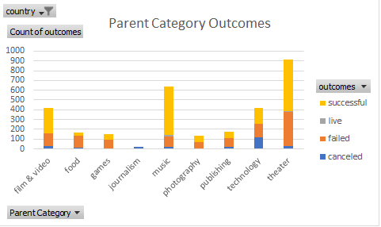

# An Analysis of Kickstarter Campaigns
## Overview
Louise is a playwright interested in using a CrowdFunding campaign for $10,000 for a play.
She would like to know more about successful campaigns.
### Purpose
We are tasked with determining factors that were present in other successful campaigns.
## Analysis and Challenges
* Used the file "Kickstarter_Challenge.xslx" as the source data of our analysis.
* Calculated percentage funded using the pledged and goal amounts.
* Calculated years after converting unix time stamps into standard dates.
* Used the Countifs() function to determine how many play campaigns were successfule, failed or canceled.
* Calculated percentages on the count results.
* Created several pivot tables to show our results.
## Categories with Outcomes
We discovered that theater was the most popular category with the most successful outcomes as you can see below.

## Outcomes Based on Launch Dates
We also found that May is the best month and December is the worst month to create successful campaigns as shown below.

## Recommendations
From our analysis, we recommend launching in May-June with a much lower goal ($5,000) and a shorter period to increase the probablity of success.
